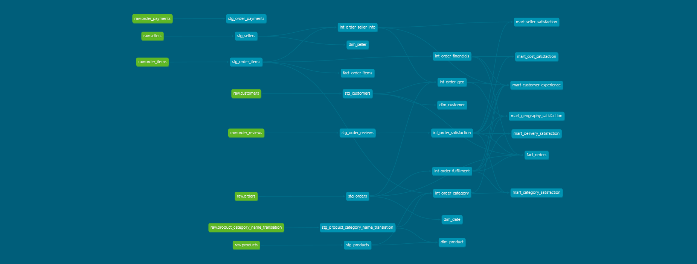

# Customer Satisfaction & Operational Analytics Pipeline

An end-to-end data engineering and analytics project analyzing the operational and transactional factors associated with customer satisfaction across approximately 100,000 e-commerce orders.

The project builds a cloud-based ELT pipeline using **PostgreSQL, Python, Google BigQuery, dbt, SQL, and Power BI**, transforming raw e-commerce data into tested analytical models and an interactive business intelligence dashboard.

---

## Business Problem

Customer satisfaction varies significantly across orders, but it is not immediately clear which operational and transactional factors are associated with higher or lower satisfaction.

The goal of this project is to identify patterns in **delivery performance, fulfillment stages, seller performance, product categories, freight costs, and shipping geography** that are associated with customer review scores and poor customer experiences.

---

## Business Questions

The analysis focuses on the following questions:

- How do delivery times and late deliveries relate to customer satisfaction?
- Which stages of order fulfillment are most associated with poor reviews?
- How does satisfaction vary across sellers?
- How does product category relate to satisfaction and delivery performance?
- How do order value and freight costs relate to satisfaction?
- Do interstate shipments experience different delivery performance and satisfaction?
- What characteristics distinguish low-satisfaction orders from high-satisfaction orders?

---

## Data Pipeline

Raw data was first loaded into **PostgreSQL**. A Python ingestion pipeline using `psycopg2` extracted the data and loaded it into **Google BigQuery**, which served as the cloud data warehouse.
**dbt** was then used to transform the raw warehouse data through staging and intermediate layers before producing analytical marts and dimensional models for downstream analysis and reporting done in **Power BI**.

---
### dbt Model Lineage

The dbt lineage graph below shows how raw BigQuery source tables are transformed through staging and intermediate models into analytical marts and dimensional models.

---

## Tech Stack

| Technology | Purpose |
|---|---|
| **PostgreSQL** | Relational source database |
| **Python / psycopg2** | Data extraction and ingestion |
| **Google BigQuery** | Cloud data warehouse |
| **dbt** | SQL transformations, testing, documentation, and lineage |
| **SQL** | Data transformation and analytical queries |
| **Power BI** | Semantic modeling, interactive dashboards, and reporting |
| **Git / GitHub** | Version control and project documentation |

---

## Data Transformation

### Staging Layer

Staging models prepare individual source tables for downstream transformation by standardizing data types and naming.

### Intermediate Layer

Reusable intermediate models were created around the major analytical concepts:

- `int_order_fulfillment`
- `int_order_financials`
- `int_order_category`
- `int_order_seller_info`
- `int_order_geo`
- `int_order_satisfaction`

These models calculate and organize metrics such as:

- Delivery duration
- Delivery delay
- Late-delivery status
- Purchase-to-approval time
- Approval-to-carrier time
- Carrier-to-customer time
- Product and freight value
- Freight-to-price ratio
- Seller and customer geography
- Review score and satisfaction level

### Analytical Marts

Question-specific marts were created for exploratory and business analysis:

- `mart_delivery_satisfaction`
- `mart_seller_satisfaction`
- `mart_category_satisfaction`
- `mart_cost_satisfaction`
- `mart_geography_satisfaction`
- `mart_customer_experience`

These models support SQL analysis of individual operational factors and customer satisfaction.

---

## Dimensional Modeling

A dimensional model was created for downstream Power BI reporting.

### Fact Tables

#### `fact_orders`

**Grain:** One row per reviewed order.

Contains order-level satisfaction, fulfillment, customer, and financial metrics.

#### `fact_order_items`

**Grain:** One row per order item.

Contains product, seller, price, and freight information.

### Dimension Tables

- `dim_customer`
- `dim_product`
- `dim_seller`
- `dim_date`

The resulting model uses two related fact tables connected to dimensions, allowing order-level customer satisfaction analysis alongside item-level seller and product analysis.

---

## Key Findings

### 1. Delivery Performance Has the Clearest Relationship With Satisfaction

On-time orders averaged **4.29 stars**, compared with **2.57 stars for late orders**, a difference of **1.73 points** across approximately **95,800 delivered orders**.

Satisfaction also progressively decreased as delivery delays became more severe.

### 2. Carrier-to-Customer Delivery Time Is an Important Fulfillment Signal

Purchase approval time showed relatively little variation in satisfaction.

However, review scores were lower for orders with longer approval-to-carrier times and particularly long **carrier-to-customer delivery times**.

### 3. Seller Performance Varies Substantially

Seller-level analysis revealed meaningful differences in average review scores.

However, seller order volume itself showed little relationship with customer satisfaction, indicating that higher-volume sellers were not necessarily associated with better or worse customer experiences.

### 4. Product Categories Show Different Satisfaction Patterns

Average satisfaction varied across product categories.

Delivery performance explained some of these differences, but category-level satisfaction did not appear to be explained by delivery performance alone.

### 5. Higher Freight Costs Are Associated With Somewhat Lower Satisfaction

Orders with higher absolute freight costs generally showed lower average satisfaction.

The relationship was smaller than the difference observed for delivery performance.

### 6. Interstate Shipping Is Associated With Longer Delivery Times

Interstate orders took substantially longer to arrive and had higher late-delivery rates than intrastate orders.

However, the difference in customer satisfaction was comparatively modest.

---

## Power BI Dashboard

The final Power BI report contains **two primary pages and a seller drill-through page**.

### 1. Customer Satisfaction Overview

### 2. Operational Drivers

### 3. Seller Drill-through

🔗 **[View the Interactive Power BI Dashboard](https://app.powerbi.com/reportEmbed?reportId=16e4f7a7-71ba-47db-a480-66a3e79b7d81&autoAuth=true&ctid=41f88ecb-ca63-404d-97dd-ab0a169fd138)**

---

## Conclusion

The analysis shows that **delivery performance is the clearest operational factor associated with customer satisfaction in this dataset**. 
